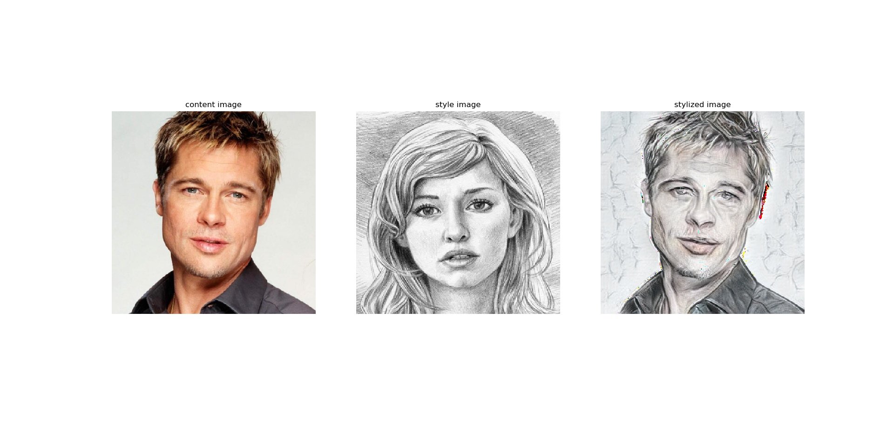

# keras implementation of AdaIN Style Transfer




## Usage for python code

#### 0. Requirement

* python 3.6
* anaconda 5.1.0
* tensorflow 1.9.0
* opencv 3.4.3.18
* Etc.


I recommend that you create and use an anaconda env that is independent of your project. You can create anaconda env for this project by following these simple steps. This process has been verified on Windows 10 and ubuntu 16.04.

```
$ conda create -n adain python=3.6 anaconda=5.1.0
$ activate adain # in linux "source activate adain"
(adain) $ pip install tensorflow==1.9.0
(adain) $ pip install opencv-python==3.4.3.18
(adain) $ pip install pytest-cov
(adain) $ pip install codecov
```

### 1. Run style transfer 

Run style transfer through the following command.

* ```(adain) project/root> python main.py -c input/content/brad_pitt.jpg -s input/style/sketch.png```

You can see the following results:

* 


## Copyright

* See [LICENSE](LICENSE) for details.

