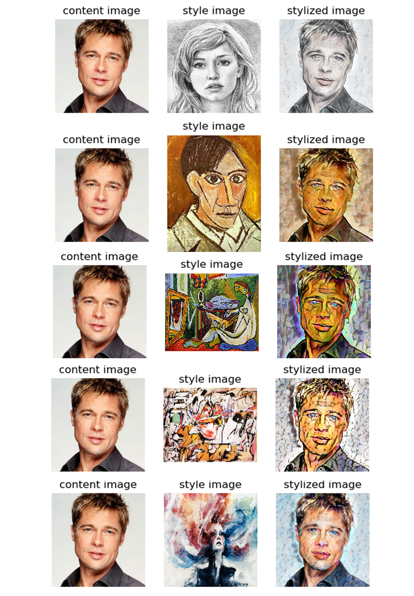
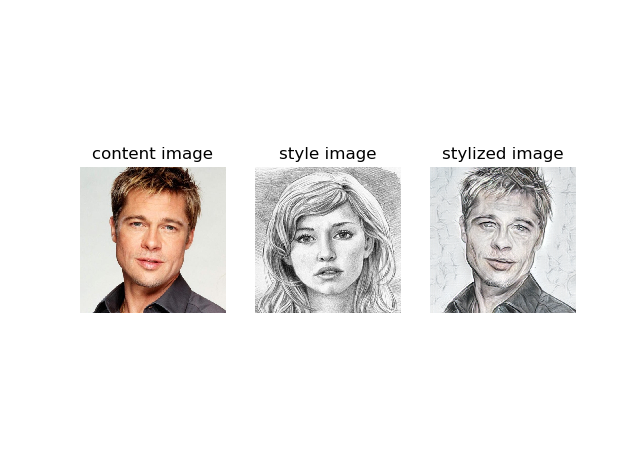

[](https://travis-ci.org/penny4860/keras-adain-style-transfer) [](https://codecov.io/gh/penny4860/keras-adain-style-transfer)


# keras implementation of AdaIN Style Transfer

Keras implementation of [Arbitrary Style Transfer in Real-time with Adaptive Instance Normalization](https://arxiv.org/abs/1703.06868).

 


## Usage for python code

#### 1. Requirement

* python 3.6
* anaconda 5.1.0
* tensorflow 1.9.0
* opencv 3.4.3.18
* Etc.


I recommend that you create and use an anaconda env that is independent of your project. You can create anaconda env for this project by following these simple steps. This process has been verified on Windows 10 and ubuntu 16.04.

```
$ conda create -n adain python=3.6 anaconda=5.1.0
$ activate adain # in linux "source activate adain"
(adain) $ pip install tensorflow==1.9.0
(adain) $ pip install opencv-python==3.4.3.18
(adain) $ pip install pytest-cov
(adain) $ pip install codecov
```

### 2. Run style transfer 

Run style transfer through the following command.

* ```(adain) project/root> python main.py -c input/content/brad_pitt.jpg -s input/style/sketch.png```

You can see the following results:

* 


## Pretrained weights


This repository contains a [pretrained weight file](pretrained/adain.h5). 
This weight file is the conversion of the torch format weight file provided in the [original project repository](https://github.com/xunhuang1995/AdaIN-style) to keras format. I used the [torchfile](https://github.com/bshillingford/python-torchfile) to read the torch format file.


## Copyright

* See [LICENSE](LICENSE) for details.

